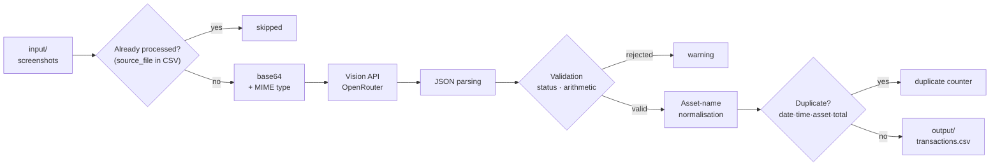

# Trade Republic → CSV

**Rebuilding an accountable stock-transaction history from plain screenshots, using a vision model.**


---

## The problem

In early 2026, Trade Republic offered no consolidated export of transaction history:
every operation had to be downloaded as an individual PDF, which made portfolio
tracking outside the app impossible. The third-party workarounds of the time were
reduced to browser extensions scraping the web page.

One medium was always available and always complete: **a screenshot of the transaction
detail screen**. The bet behind this project: a vision model can read those
screenshots reliably — provided the LLM call is surrounded with enough guardrails that
the result is an *accountable* dataset rather than an approximation.

> **Context, for transparency** — Trade Republic shipped a native CSV export in
> mid-April 2026, about a month after this project was written (last functional
> commit: 10 March 2026; last transaction processed: 5 March 2026). The original need
> no longer exists as such. The repo is kept for what it demonstrates: **a structured
> extraction chain made reliable around a non-deterministic LLM** — a problem that is
> still very much current.

---

## The technical approach

A vision LLM is probabilistic: it hallucinates, it varies, it fails silently. The core
of this project is therefore not the API call — about forty lines — but **the layers
that turn unreliable output into verified data**:

| Guardrail | Mechanism | Where |
|---|---|---|
| **Constrained output** | `temperature = 0.0` + a prompt mandating strict JSON, with Markdown fence stripping | `src/infra/llm_client.py` |
| **Arithmetic cross-check** | `units × price ± fees ≈ total`, 5 % tolerance → warning beyond the threshold | `src/domain/validation.py` |
| **Status filtering** | Only `completed` and `executed` produce a row; `rejected`, `pending`, `not_a_transaction` are discarded | `src/domain/validation.py` |
| **Self-assessment** | The model returns a `confidence` and a `notes` field; both surface as warnings | `src/domain/validation.py` |
| **Label consistency** | A second, short LLM call maps an unknown asset name onto one already on record (typo, casing, missing word) | `src/app/normalize.py` |
| **Idempotence** | An image that already produced a row is never sent back to the API; a transaction already present is never duplicated | `src/app/extract.py`, `src/infra/csv_store.py` |
| **No data loss** | Intermediate save every 10 images | `src/app/extract.py` |

An error never interrupts processing: each image is isolated in its own `try`, and
incidents are aggregated into a final report (`added / duplicates / errors / skipped`).

---

## Stack

| | |
|---|---|
| **Language** | Python 3.10+ (floor imposed by `truststore`; verified on 3.12) |
| **Model** | `qwen/qwen3.5-flash-02-23` via the OpenRouter API (OpenAI-compatible) |
| **HTTP client** | `urllib.request` — standard library, no third-party HTTP dependency on the extraction path |
| **Configuration** | `CONFIG.yaml` (non-secret) + `.env` (API key), merged and validated by Pydantic |
| **Output** | `;`-separated CSV in UTF-8 BOM, opens directly in Excel |
| **Optional** | `gspread` + `google-auth` for the Google Sheets sync |

---

## Architecture

```
investor/
├── main.py                        # CLI entry point: subcommands, .env, guardrails
├── CONFIG.yaml                    # Non-secret configuration (paths, model, sync)
├── prompts/
│   └── extraction.md              # Extraction prompt — editable without touching code
├── src/                           # Layered architecture: app / domain / infra
│   ├── app/                       # Use cases — orchestration
│   │   ├── extract.py             # Extraction loop: checkpoints, report, quarantine
│   │   ├── normalize.py           # Asset-label normalisation
│   │   └── sync.py                # Google Sheets synchronisation
│   ├── domain/                    # Business rules — no external dependency
│   │   ├── models.py              # Transaction dataclass
│   │   ├── validation.py          # Business checks → Transaction | None + warnings
│   │   ├── asset_rules.py         # Asset-name reconciliation
│   │   ├── dedup.py               # Duplicate detection
│   │   └── datetime_utils.py      # Date normalisation
│   ├── infra/                     # Adapters — everything touching the outside world
│   │   ├── llm_client.py          # OpenRouter client (vision + text)
│   │   ├── image_encoder.py       # base64 encoding + MIME detection
│   │   ├── csv_store.py           # CSV read, dedup and write
│   │   └── sheets_client.py       # Google Sheets client
│   ├── config.py                  # Centralised configuration (YAML + env + CLI)
│   └── display.py                 # Console rendering of the report
├── tests/                         # 33 tests: unit, integration, end-to-end
├── input/                         # Screenshots to process (contents git-ignored)
└── output/
    └── transactions.example.csv   # Output format, fictional data
```

The split follows hexagonal-architecture logic: `domain/` knows nothing of the network
or the disk, `infra/` isolates external dependencies, and `app/` orchestrates the two.
Business rules are therefore testable without a single stub — which is why the suite
runs in half a second with no API key.

### The pipeline



**The non-obvious point**: there is no separate state file. The `source_file` column of
the output CSV *is* the registry of already-processed images, and the asset names
already present *are* the normalisation reference. The CSV is simultaneously the
result and the program's memory — one less file to keep in sync, and a state that
cannot drift out of alignment with the output.

---

## Installation

```bash
git clone https://github.com/Skeeder1/investor.git
cd investor

python3 -m venv .venv
source .venv/bin/activate        # Linux / macOS
# .venv\Scripts\activate         # Windows

pip install -r requirements.txt
```

## Configuration

Configuration comes from two files with distinct roles:

**`.env`** — the secret. One variable:

```bash
cp .env.example .env
```

```
OPENROUTER_API_KEY=sk-or-v1-...
```

The key is obtained at <https://openrouter.ai/keys> ("Create Key"). Without it, the
program stops before any network call:

```
Error: No API key. Set OPENROUTER_API_KEY in .env file.
```

**`CONFIG.yaml`** — everything non-secret. `src/config.py` refuses to load this file if
it contains anything resembling an API key.

```yaml
app:
  mode: extract        # all | extract | sync
  test: true           # limit to 1 image — see the warning below

paths:
  input_dir: input
  output_csv: output/transactions.csv
  quarantine_dir: output/quarantine

llm:
  model: qwen/qwen3.5-flash-02-23
  temperature: 0.0

google_sheets:
  sync_enabled: false  # opt-in — see "Google Sheets sync"
  spreadsheet_id: ""
  sheet_name: "CTO"
  service_account_path: ~/.config/google/service-account.json
```

Precedence is **CLI argument > `CONFIG.yaml` > code default**.

> **`test: true` ships enabled on purpose.** Every normal run costs one paid API call
> per image. Test mode caps a run at a single image, so a fresh clone cannot burn
> credit by accident. Set it to `false` — or use the `all` / `extract` subcommand
> without `--test` — once you have validated your setup.

## Usage

Drop the screenshots into `input/`, then:

```bash
python main.py extract                  # input/ → output/transactions.csv
python main.py extract ./captures/      # a different source folder
python main.py extract -o output/2026.csv --delay 1.5
python main.py all                      # extraction, then Google Sheets sync
python main.py sync                     # sync only, no API call
```

Called with no subcommand, `main.py` implies `all`.

| Argument | Description | Default |
|---|---|---|
| `input_dir` | Source folder for the screenshots | `input` |
| `-o`, `--output` | Output CSV file | `output/transactions.csv` |
| `--delay` | Pause between two API calls, in seconds | `1.0` |
| `--test` | Caps processing at **1 image**, whatever the folder contains | from `CONFIG.yaml` |
| `--sync` / `--no-sync` | Force the Sheets sync on or off (`all` only) | from `CONFIG.yaml` |
| `--sync-mode` | `send`, `dry-run` or `confirm` | `send` |
| `--sync-limit` | Cap the number of rows synced | unlimited |

Accepted formats: `.png`, `.jpg`, `.jpeg`, `.webp`, `.heic`.

### Example session

```
────────────────────────────────────────────────────────────
  Total images    : 42
  Already done    : 30
  To process      : 12
  Model           : qwen/qwen3.5-flash-02-23
  Output          : output/transactions.csv
────────────────────────────────────────────────────────────
[1/12] IMG_0001.PNG ... OK BUY 50.0€  Core S&P 500 USD (Acc)
[2/12] IMG_0002.PNG ... OK SELL 473.99€  Ethereum
[3/12] IMG_0003.PNG ... SKIP  not a transaction screenshot
...
──  checkpoint: 9 transaction(s) saved  ──
────────────────────────────────────────────────────────────

✅  11 transaction(s) added → output/transactions.csv

⚠️  Warnings (1)
  FIX IMG_0009.PNG: 'Core S&P500 USD Acc' → 'Core S&P 500 USD (Acc)'

Summary  11 added  /  0 duplicate(s)  /  0 error(s)  /  1 skipped
```

Re-running the same command does not reprocess the images that produced a row: their
names are now in the `source_file` column. Only `IMG_0003.PNG`, discarded without
producing a row, goes back to the API (see *Known limitations*).

### Google Sheets sync (optional)

Disabled by default. To enable it, set `sync_enabled: true` and your own
`spreadsheet_id` in `CONFIG.yaml`, and point `service_account_path` at a Google
service-account key with write access to that sheet. Then:

```bash
python main.py sync --mode dry-run    # show what would be sent, change nothing
python main.py sync                   # actually send
```

`dry-run` prints the rows that would be appended without touching either the CSV or
the sheet — the safe way to verify a mapping before committing to it.

### Output format

Extract from `output/transactions.example.csv`:

```csv
sep=;
date;time;asset_name;type;asset_price;units;fees;total;source_file
2025-09-01;09:12;Core S&P 500 USD (Acc);buy;128.44;0.389289;0.0;50.0;IMG_0001.PNG
2025-09-04;18:02;Bitcoin;buy;54210.0;0.001845;1.0;101.02;IMG_0003.PNG
2025-10-06;20:44;Bitcoin;sell;58900.0;0.001699;1.0;99.08;IMG_0006.PNG
2025-11-03;09:20;S&P 500 EUR (Acc);pea;0.0;0.0;0.0;30.2;IMG_0009.PNG
```

Rows are sorted by date then time. `type` is `buy`, `sell` or `pea` — PEA operations
expose no "units × price" line, so their `units`, `asset_price` and `fees` fields are
`0.0` and they are exempt from the arithmetic check.

---

## Technical decisions

**The prompt lives outside the code.** `prompts/extraction.md` is loaded at runtime.
Adapting extraction to a new app layout requires no Python change — it is the file
that changes most often, so it is isolated from what changes least. The trade-off is a
constraint to maintain: the statuses marked valid in the prompt must stay aligned with
`valid_statuses` in `src/domain/validation.py`.

**The CSV as state.** The classic approach — a manifest of SHA-256 fingerprints in a
dedicated JSON — imposes two files to keep consistent for information already
contained in the output. Reading the `source_file` column is enough, at the cost of
deduplication by filename rather than by content (see *Known limitations*).

**No HTTP dependency on the extraction path.** The standard library's
`urllib.request` covers the need — two JSON POST requests. The only third-party
packages the core path needs are `python-dotenv`, `truststore`, `pyyaml` and
`pydantic`; `gspread` and `google-auth` are pulled in solely by the optional Sheets
sync. The goal was a utility that could be picked up months later without install
surprises.

**Two levels of deduplication.** The first avoids the spend (never send an
already-processed image back to the API); the second guarantees integrity (key
`date · time · asset · total`, including within a single batch). They protect against
different things, so both are necessary.

**LLM-based label normalisation.** The vision model sometimes transcribes
"Core S&P500 USD Acc" where the reference holds "Core S&P 500 USD (Acc)". Left
untreated, one asset splits into two and every aggregate becomes wrong. A Levenshtein
distance would wrongly merge two genuinely distinct ETFs with similar names, so the
comparison is delegated to a short LLM call — **triggered only when exact matching
fails**, so the vast majority of rows consume none. The model's answer is accepted
only if it matches a known asset *exactly*, which prevents it inventing a label.

**Excel compatibility.** The CSV opens on a double-click in Excel thanks to two
details: the `sep=;` header line and UTF-8 **with BOM**. Without the BOM,
"Société Générale" renders as "Société". Symmetrically, reading reopens files as
`utf-8-sig` and skips the `sep=;` line when present.

**Locked file.** If the CSV is open in Excel, the write would fail at the end of
processing — after every API call has been paid for. The program therefore tests write
access **before starting**, and waits, telling the user what to do.

---

## Tests

```bash
pip install -r requirements-dev.txt
pytest
```

```
.................................                                        [100%]
33 passed in 0.54s
```

No API key and no network access are required: the layered split means the domain
rules, the CSV store and the full extraction pipeline are all exercised against fakes.
`tests/e2e/test_full_pipeline.py` covers a complete run plus an idempotent re-run.

---

## Known limitations

- **Deduplication by filename.** The same screenshot, renamed, will be sent back to
  the API. The second layer stops the duplicate row reaching the CSV, but the call is
  billed. A content hash would fix this.
- **Discarded screenshots are reprocessed.** Since the registry of processed images is
  the `source_file` column, a screenshot that produces no row — status `rejected` or
  `pending`, a non-transactional screen — never appears there and goes back to the API
  on every run.
- **Quarantine.** A screenshot the model returns as `failed` is moved to a quarantine
  folder rather than processed (`src/app/extract.py`), with filename-collision
  handling. Nothing is deleted: the screenshot stays inspectable.
- **Inferred year.** When the screenshot shows no year, the prompt applies a fixed
  calendar rule (`prompts/extraction.md`) that needs an annual update.
- **Tied to one layout.** The prompt describes the Trade Republic interface as it was
  in early 2026; an app redesign would invalidate it.

---

## Documentation

- [`docs/architecture.md`](docs/architecture.md) — detailed walkthrough of the pipeline, module by module
- [`docs/decisions-techniques.md`](docs/decisions-techniques.md) — decisions, rejected alternatives and why

## Licence

MIT — see [LICENSE](LICENSE).
