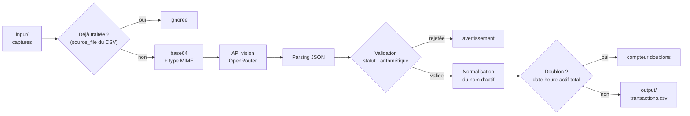

# Trade Republic → CSV

**Reconstruire un historique de transactions boursières exploitable à partir de simples captures d'écran, via un modèle de vision.**


---

## Le problème

Début 2026, Trade Republic ne proposait aucun export consolidé de l'historique de
transactions : chaque opération se téléchargeait en PDF individuel, ce qui rendait
impossible tout suivi de portefeuille en dehors de l'application. Les solutions
tierces de l'époque en étaient réduites à des extensions de navigateur qui grattaient
la page web.

Restait un support toujours disponible et exhaustif : **la capture d'écran de l'écran
de détail d'une transaction**. Le pari du projet : un modèle de vision peut lire ces
captures de façon fiable, à condition d'entourer l'appel LLM d'assez de garde-fous
pour que le résultat soit un jeu de données *comptable*, et pas une approximation.

> **Contexte, en toute transparence** — Trade Republic a livré un export CSV natif
> mi-avril 2026, soit environ un mois après l'écriture de ce projet (dernier commit
> fonctionnel : 10 mars 2026 ; dernière transaction traitée : 5 mars 2026). Le besoin
> initial n'existe donc plus tel quel. Ce dépôt reste conservé pour ce qu'il
> démontre : **une chaîne d'extraction structurée fiabilisée autour d'un LLM
> non déterministe** — un problème, lui, toujours d'actualité.

---

## L'approche technique

Un LLM de vision est probabiliste : il hallucine, il varie, il échoue silencieusement.
Le cœur du projet n'est donc pas l'appel API — une quarantaine de lignes — mais
**les couches qui transforment une sortie non fiable en données vérifiées** :

| Garde-fou | Mécanisme | Où |
|---|---|---|
| **Sortie contrainte** | `temperature = 0.0` + prompt imposant un JSON strict, nettoyage des fences Markdown | `src/llm.py` |
| **Contrôle arithmétique** | `unités × prix ± frais ≈ total`, tolérance 5 % → avertissement si l'écart dépasse le seuil | `src/validation.py` |
| **Filtrage par statut** | Seuls `completed` et `executed` produisent une ligne ; `rejected`, `pending`, `not_a_transaction` sont écartés | `src/validation.py` |
| **Auto-évaluation** | Le modèle renvoie un champ `confidence` et un champ `notes` ; les deux remontent en avertissement | `src/validation.py` |
| **Cohérence des libellés** | Un second appel LLM rattache un nom d'actif inconnu à un nom déjà enregistré (faute de frappe, casse, mot manquant) | `src/assets.py` |
| **Idempotence** | Une image ayant déjà produit une ligne n'est jamais renvoyée à l'API ; une transaction déjà présente n'est jamais dupliquée | `src/processor.py`, `src/csv_writer.py` |
| **Aucune perte** | Sauvegarde intermédiaire toutes les 10 images | `src/processor.py` |

Une erreur n'interrompt jamais le traitement : chaque image est isolée dans son propre
`try`, et les incidents sont agrégés dans un rapport final (`ajoutée(s) / doublon(s) /
erreur(s) / ignorée(s)`).

---

## Stack

| | |
|---|---|
| **Langage** | Python 3.10+ (plancher imposé par `truststore` ; vérifié sur 3.12) |
| **Modèle** | `qwen/qwen3.5-flash-02-23` via l'API OpenRouter (compatible OpenAI) |
| **Client HTTP** | `urllib.request` — bibliothèque standard, aucune dépendance HTTP tierce |
| **Dépendances** | `python-dotenv` (chargement du `.env`), `truststore` (magasin de certificats système) |
| **Sortie** | CSV `;` en UTF-8 BOM, ouvrable directement dans Excel |

---

## Architecture

```
investor/
├── main.py                        # Point d'entrée CLI : argparse, .env, garde-fous
├── prompts/
│   └── extraction.md              # Prompt d'extraction — modifiable sans toucher au code
├── src/
│   ├── processor.py               # Orchestrateur : boucle, checkpoints, rapport
│   ├── image.py                   # Encodage base64 + détection du type MIME
│   ├── llm.py                     # Client OpenRouter (vision + texte) et chargement du prompt
│   ├── validation.py              # Contrôles métier → Transaction | None + avertissements
│   ├── assets.py                  # Normalisation des noms d'actifs (fuzzy matching LLM)
│   ├── csv_writer.py              # Déduplication puis écriture du CSV trié
│   └── models.py                  # Dataclass Transaction (10 champs)
├── input/                         # Captures à traiter (contenu ignoré par Git)
└── output/
    ├── transactions.csv           # Sortie et, simultanément, état d'avancement
    └── transactions.example.csv   # Même format, données fictives
```

### Le pipeline



**Le point non évident** : il n'existe aucun fichier d'état séparé. La colonne
`source_file` du CSV de sortie *est* le registre des images déjà traitées, et les
noms d'actifs déjà présents *sont* le référentiel de normalisation. Le CSV est à la
fois le résultat et la mémoire du programme — un fichier de moins à synchroniser,
et un état impossible à désaligner de la sortie.

---

## Installation

```bash
git clone https://github.com/Skeeder1/investor.git
cd investor

python3 -m venv .venv
source .venv/bin/activate        # Linux / macOS
# .venv\Scripts\activate         # Windows

pip install -r requirements.txt
```

## Configuration

```bash
cp .env.example .env
```

Puis renseigner la clé dans `.env` :

```
OPENROUTER_API_KEY=sk-or-v1-...
```

La clé s'obtient sur <https://openrouter.ai/keys> (« Create Key »). Chaque variable
est documentée dans `.env.example`. Sans clé, le programme s'arrête avant tout appel
réseau :

```
Error: No API key. Set OPENROUTER_API_KEY in .env file.
```

## Utilisation

Déposer les captures d'écran dans `input/`, puis :

```bash
python main.py                    # input/ → output/transactions.csv
python main.py ./captures/        # autre dossier source
python main.py ./input/ -o output/2026.csv --delay 1.5
python main.py --test             # 1 seule image — à utiliser pour valider une modification
```

| Argument | Description | Défaut |
|---|---|---|
| `input_dir` | Dossier source des captures | `input` |
| `-o`, `--output` | Fichier CSV de sortie | `output/transactions.csv` |
| `--delay` | Pause entre deux appels API, en secondes | `1.0` |
| `--test` | Limite le traitement à **1 image**, quel qu'en soit le nombre dans le dossier | désactivé |

> **`--test` avant tout lancement complet.** Chaque exécution normale déclenche un
> appel payant par image. `--test` borne le traitement à une seule image (1 appel
> vision, plus éventuellement 1 appel texte si le nom d'actif est inconnu).

Formats acceptés : `.png`, `.jpg`, `.jpeg`, `.webp`, `.heic`.

### Exemple de session

```
────────────────────────────────────────────────────────────
  Images totales  : 42
  Déjà traitées  : 30
  À traiter       : 12
  Modèle          : qwen/qwen3.5-flash-02-23
  Sortie          : output/transactions.csv
────────────────────────────────────────────────────────────
[1/12] IMG_0001.PNG ... OK BUY 50.0€  Core S&P 500 USD (Acc)
[2/12] IMG_0002.PNG ... OK SELL 473.99€  Ethereum
[3/12] IMG_0003.PNG ... SKIP  not a transaction screenshot
...
──  checkpoint: 9 transaction(s) sauvegardée(s)  ──
────────────────────────────────────────────────────────────

✅  11 transaction(s) ajoutée(s) → output/transactions.csv

⚠️  Avertissements (1)
  FIX IMG_0009.PNG: 'Core S&P500 USD Acc' → 'Core S&P 500 USD (Acc)'

Résumé  11 ajoutée(s)  /  0 doublon(s)  /  0 erreur(s)  /  1 ignorée(s)
```

Relancer la même commande ne retraite pas les 41 images ayant produit une ligne :
leur nom figure désormais dans la colonne `source_file`. Seule `IMG_0003.PNG`, écartée
sans produire de ligne, repartira vers l'API (voir *Limites*).

### Format de sortie

Extrait de `output/transactions.example.csv` :

```csv
sep=;
date;time;asset_name;type;asset_price;units;fees;total;source_file
2025-09-01;09:12;Core S&P 500 USD (Acc);buy;128.44;0.389289;0.0;50.0;IMG_0001.PNG
2025-09-04;18:02;Bitcoin;buy;54210.0;0.001845;1.0;101.02;IMG_0003.PNG
2025-10-06;20:44;Bitcoin;sell;58900.0;0.001699;1.0;99.08;IMG_0006.PNG
2025-11-03;09:20;S&P 500 EUR (Acc);pea;0.0;0.0;0.0;30.2;IMG_0009.PNG
```

Les lignes sont triées par date puis heure. `type` vaut `buy`, `sell` ou `pea` — les
opérations PEA n'exposant pas de ligne « unités × prix », leurs champs `units`,
`asset_price` et `fees` valent `0.0` et échappent au contrôle arithmétique.

---

## Choix techniques

**Le prompt vit hors du code.** `prompts/extraction.md` est chargé à l'exécution.
Adapter l'extraction à une nouvelle mise en page de l'application ne demande aucune
modification Python — c'est le fichier qui change le plus souvent, il est donc isolé
de ce qui change le moins. En contrepartie, une contrainte à tenir : les statuts
marqués valides dans le prompt doivent rester alignés sur `valid_statuses` dans
`src/validation.py`.

**Le CSV comme état.** L'approche classique — un manifeste d'empreintes SHA-256 dans
un JSON dédié — impose deux fichiers à garder cohérents pour une information déjà
contenue dans la sortie. Lire la colonne `source_file` suffit, au prix d'une
déduplication par nom de fichier et non par contenu (voir *Limites*).

**Aucune dépendance HTTP.** `urllib.request` de la bibliothèque standard couvre le
besoin — deux requêtes POST JSON. Deux dépendances externes seulement, pour un
utilitaire destiné à être relancé des mois plus tard sans surprise d'installation.

**Deux niveaux de déduplication.** Le premier évite la dépense (ne pas renvoyer une
image déjà traitée à l'API) ; le second garantit l'intégrité (clé
`date · heure · actif · total`, y compris au sein d'un même lot). Ils ne protègent
pas de la même chose et sont donc tous les deux nécessaires.

**Normalisation des libellés par LLM.** Le modèle de vision retranscrit parfois
« Core S&P500 USD Acc » là où le référentiel contient « Core S&P 500 USD (Acc) ».
Sans traitement, un même actif se dédouble et tout agrégat devient faux. Une distance
de Levenshtein classerait à tort deux ETF réellement distincts aux noms proches ;
la comparaison est donc confiée à un appel LLM court, **déclenché uniquement en cas
d'échec de la correspondance exacte** — l'immense majorité des lignes n'en consomme
aucun.

**Compatibilité Excel.** Le CSV s'ouvre en double-clic sous Excel grâce à deux
détails : la ligne d'en-tête `sep=;` et l'encodage UTF-8 **avec BOM**. Sans le BOM,
« Société Générale » s'affiche « Société ». Symétriquement, la lecture rouvre les
fichiers en `utf-8-sig` et saute la ligne `sep=;` si elle est présente.

**Fichier verrouillé.** Si le CSV est ouvert dans Excel, l'écriture échouerait en
fin de traitement — après avoir payé tous les appels API. Le programme teste donc
l'accès en écriture **avant de commencer** et attend, en affichant quoi faire.

---

## Limites connues

- **Déduplication par nom de fichier.** Une même capture renommée sera renvoyée à
  l'API. La deuxième couche empêche la ligne en double dans le CSV, mais l'appel est
  facturé. Une empreinte de contenu corrigerait ce point.
- **Les captures écartées sont retraitées.** Le registre des images traitées étant la
  colonne `source_file`, une capture qui ne produit aucune ligne — statut `rejected`
  ou `pending`, écran non transactionnel — n'y figure jamais et repart vers l'API à
  chaque exécution.
- **Suppression automatique.** Une capture dont le modèle renvoie le statut `failed`
  est **supprimée du disque** (`src/processor.py`). Comportement voulu — purger les
  transactions échouées — mais destructif et sans confirmation.
- **Aucun test automatisé.** Les couches pures (`validation`, `csv_writer`,
  `assets`) sont testables hors ligne sans appel API ; elles ne le sont pas encore.
- **Année déduite.** Lorsque la capture n'affiche pas l'année, le prompt applique une
  règle calendaire figée (`prompts/extraction.md`) qui demande une mise à jour
  annuelle.
- **Dépendance à une mise en page.** Le prompt décrit l'interface Trade Republic
  telle qu'elle était début 2026 ; une refonte de l'application le rendrait caduc.

---

## Documentation

- [`docs/architecture.md`](docs/architecture.md) — parcours détaillé du pipeline, module par module
- [`docs/decisions-techniques.md`](docs/decisions-techniques.md) — décisions, alternatives écartées et raisons
